# LUCIUS Option B: Invoker-Owned Ledger + Bus Callbacks Spec

This document defines the Option B architecture where the **lucius-invoker** owns
ledger updates after job creation and receives ACK/RESULT via Service Bus.
Temporal remains the orchestration source of truth, and the ledger is a read-model.

---

## 1) Scope and Assumptions

**In scope**
- API + Orchestrator Gateway (FastAPI).
- Temporal workflows + activities.
- Service Bus dispatch and routing lanes.
- Ledger read-model (Azure Table Storage).
- Protocol registry + step schema validation.
- AuthN/AuthZ at the API boundary.

**Out of scope**
- Internal platform service logic (OCR/Embedding/SIS implementation).
- Artifact storage details beyond references.
- Unified Services scale or SLOs.

**Assumptions**
- Platform services do **not** use Temporal SDK.
- Orchestrator starts workflows; invoker signals step progress.
- Ledger is a read-model; Temporal is the orchestration source of truth.
- Service Bus routing is deterministic and stable.

## 2) Core Goals

- Preserve the existing API surface and contracts.
- Keep Service Bus topics and deterministic partitioning (lanes).
- Make orchestration durable: retries, timeouts, sequencing handled by Temporal.
- Keep a clean, queryable ledger for job and step status.
- Maintain idempotency across duplicates and retries.

## 2.1 Non-Functional Requirements
- Scalability: Temporal workers scale horizontally; API scales for ingress.
- Backpressure: per-tenant inflight limits at ingress.
- Observability: structured logs, metrics, traces with correlation IDs.

## 3) Terminology

- **Job**: The end-to-end request instance.
- **Step**: One unit of work (OCR/Embedding/SIS), executed sequentially unless configured otherwise.
- **Workflow**: Temporal orchestrator for a job.
- **Activity**: Temporal unit that performs an external side-effect.
- **Lane**: Service Bus partition chosen by deterministic hash.
- **Ledger**: Azure Table Storage read-model for API queries.

## 4) API Surface

- `POST /v1/orchestrate` (renamed from `/v1/commands`)
- `GET /v1/jobs/{jobId}`
- `GET /v1/jobs/{jobId}/steps`
- `POST /v1/jobs/{jobId}:cancel`
- `POST /v1/jobs/{jobId}:pause`
- `POST /v1/jobs/{jobId}:resume`

The orchestrate endpoint returns `202` as soon as the job and workflow are created.

### 4.1 Read APIs (Job/Step State)
- `GET /v1/jobs/{jobId}` returns job state from the ledger **JOB** row and collated STEP rows.
- `GET /v1/jobs/{jobId}/steps` returns step state from the ledger **STEP** rows.
- These read APIs do not query Temporal directly.

## 5) Request Envelope and Validation

### 5.1 Envelope (v1)
Required:
- `tenant_id`
- `request_type`
- `input_ref`
- `output_ref`
- `payload`
- `schema_version`

Optional:
- `mode` (DEFAULT or BURST)
- `idempotency_key`
- `doc_id` (required for BURST)
- `callback_urls`
- `correlation_id`, `traceparent`

### 5.2 Validation
- Envelope schema validation.
- Protocol resolution from `request_type`.
- Step payload validation using protocol step schemas.
- Input/output reference validation and policy checks.

## 6) Protocol Registry and Step Definitions

- `request_type` maps to a protocol definition.
- Protocol defines ordered steps and ownership (platform service for each step).
- Steps are executed sequentially unless a workflow explicitly runs in parallel.

## 7) Routing and Partitioning (Service Bus)

### 7.1 Routing Key
- DEFAULT: `routing_key_used = tenant_id`
- BURST: `routing_key_used = tenant_id + doc_id` (doc_id required)

### 7.2 Lane Selection
- `lane = CRC32(utf8(routing_key_used)) % 16`

### 7.3 Topic
- `global-bus-p{lane}`

Lane and routing_key_used are stored in the ledger for audit and debugging.

## 8) Services and Responsibilities

### 1.1 lucius-orchestrator (FastAPI)
- Validates command envelopes and step payloads.
- Resolves protocol definitions and builds Job + Steps.
- Writes initial rows to the ledger (Job + Step rows only).
- Starts the Temporal workflow (`workflow_id = job_id`).
- Does **not** process ACK/RESULT or update step/job state after creation.

### 1.2 lucius-temporal-worker
- Runs the Temporal workflow + activities.
- Calls lucius-invoker to publish directives to Service Bus.
- Waits for `step_ack` and `step_result` signals.
- Handles retries, timeouts, and step sequencing.

### 1.3 lucius-invoker (X-SDK)
- Owns the Temporal client for **signals only** (no workflow starts).
- Consumes ACK/RESULT from Service Bus reply topics.
- Updates the ledger on ACK/RESULT and attempt/lease.
- Signals the workflow (`step_ack`, `step_result`).

### 1.4 Platform Services (Service A/B/etc.)
- Consume directives from Service Bus.
- Execute work for their owned step type(s).
- Emit ACK/RESULT back to Service Bus reply topics.
- Do not use Temporal SDK.

---

## 9) End-to-End Flow (Detailed)

### 9.1 Sequence Diagram

```mermaid
sequenceDiagram
  participant API as lucius-orchestrator
  participant TW as lucius-temporal-worker
  participant INV as lucius-invoker
  participant SB as Service Bus
  participant SVC as Platform Service
  participant LED as Ledger (Single Table)
  participant TEMP as Temporal Server

  API->>LED: Create JOB + STEP rows
  API->>TEMP: Start workflow (workflow_id=job_id)
  TEMP-->>TW: Workflow task
  TW->>INV: record_attempt_lease (activity)
  INV->>LED: Update STEP (INITIATED) + JOB (current step)
  TW->>INV: publish_directive (activity)
  INV->>SB: Publish DIRECTIVE
  SB-->>SVC: Deliver DIRECTIVE
  SVC->>SB: Publish ACK
  SB-->>INV: Deliver ACK
  INV->>LED: STEP -> PROCESSING
  INV->>TEMP: Signal step_ack
  SVC->>SB: Publish RESULT
  SB-->>INV: Deliver RESULT
  INV->>LED: STEP -> SUCCEEDED/FAILED_*
  INV->>LED: JOB terminal update + final_output (if last step success)
  INV->>TEMP: Signal step_result
  TEMP-->>TW: Workflow continues or completes
```


### Phase 0 — Command Ingress (Orchestrator)
1. Validate request envelope and resolve protocol.
2. Compute routing: `routing_key_used`, `lane`, topic name.
3. Create ledger rows:
   - JOB row with `status=QUEUED`
   - STEP rows with `status=PENDING`
4. Start Temporal workflow (`workflow_id = job_id`).
5. Return `202 { jobId }`.

### Phase 1 — Workflow Step Execution (Temporal Worker)
For each step:
1. **Record attempt/lease** (activity call to invoker).
2. **Publish directive** (activity call to invoker).
3. Wait for `step_result` signal or timeout.
4. On `FAILED_RETRY`, retry if attempts remain.
5. On `FAILED_FINAL`, fail workflow.

### Phase 2 — Platform Worker
1. Receive directive from Service Bus.
2. Post **ACK** to reply topic.
3. Execute work and post **RESULT** to reply topic.

### Phase 3 — Invoker (Ledger Owner)
1. On ACK:
   - Update step to `PROCESSING`.
   - Signal Temporal: `step_ack`.
2. On RESULT:
   - Update step to `SUCCEEDED` / `FAILED_RETRY` / `FAILED_FINAL`.
   - Update job status if terminal.
   - If final step SUCCEEDED, set `final_output`.
   - Signal Temporal: `step_result`.

---

## 10) Service Bus Topics and Reply Conventions

### 10.4 Bus Topology


### 10.1 Directive Topics
- `global-bus-p{lane}` (lane = CRC32(routing_key_used) % 16)

### 10.2 Reply Topics
- `global-bus-replies-p{lane}`
- Invoker subscribes to all reply topics (one subscription per lane).

### 10.3 Message Types
- `type = "DIRECTIVE" | "ACK" | "RESULT"`

---

## 11) Message Contracts

### 11.1 Directive (Orchestrator -> Platform via Invoker)
Required fields:
- `jobId`, `tenant_id`, `stepId`, `protocol_id`, `step_type`
- `attempt_no`, `lease_id`
- `input_ref`, `workspace_ref`, `output_ref`
- `payload`
- `mode`, `lane`, `routing_key_used`
- `correlation_id`, `traceparent`

### 11.2 ACK (Platform -> Invoker via Bus)
Required fields:
- `type = "ACK"`
- `jobId`, `stepId`, `tenant_id`
- `attempt_no`, `lease_id`
- `timestamp`
- `correlation_id` (optional)

### 11.3 RESULT (Platform -> Invoker via Bus)
Required fields:
- `type = "RESULT"`
- `jobId`, `stepId`, `tenant_id`
- `attempt_no`, `lease_id`
- `status = SUCCEEDED | FAILED_RETRY | FAILED_FINAL`
- `timestamp`

Optional:
- `error { code, message }`
- `output_ref` (for final step)
- `correlation_id`

### 11.4 Example Messages (JSON)

Directive:
```json
{
  "type": "DIRECTIVE",
  "jobId": "job_123",
  "tenant_id": "tenant_a",
  "stepId": "step_01",
  "protocol_id": "doc_ingest_v1",
  "step_type": "OCR",
  "attempt_no": 1,
  "lease_id": "9a7c...",
  "input_ref": {"uri": "s3://.../input.pdf"},
  "workspace_ref": {"uri": "s3://.../workspace/"},
  "output_ref": {"uri": "s3://.../output.json"},
  "payload": {"language": "en"},
  "mode": "DEFAULT",
  "lane": 4,
  "routing_key_used": "tenant_a",
  "correlation_id": "corr-123",
  "traceparent": "00-4bf92f3577b34da6a3ce929d0e0e4736-00f067aa0ba902b7-00"
}
```

ACK:
```json
{
  "type": "ACK",
  "jobId": "job_123",
  "stepId": "step_01",
  "tenant_id": "tenant_a",
  "attempt_no": 1,
  "lease_id": "9a7c...",
  "timestamp": "2026-01-27T10:02:00Z",
  "correlation_id": "corr-123"
}
```

RESULT:
```json
{
  "type": "RESULT",
  "jobId": "job_123",
  "stepId": "step_01",
  "tenant_id": "tenant_a",
  "attempt_no": 1,
  "lease_id": "9a7c...",
  "status": "SUCCEEDED",
  "output_ref": {"uri": "s3://.../output.json"},
  "timestamp": "2026-01-27T10:02:30Z",
  "correlation_id": "corr-123"
}
```

### 11.5 Invoker Internal API (for Temporal Activities)

Temporal worker calls invoker via HTTP (internal-only).

**POST /v1/internal/steps/attempt**
- Purpose: record attempt/lease in ledger.
- Request:
  - `jobId`, `stepId`, `tenant_id`
  - `attempt_no`, `lease_id`, `lease_expires_at`
- Response: `200 { "status": "ok" }`
- Failure: non-2xx -> activity retries.

**POST /v1/internal/publish**
- Purpose: publish directive to Service Bus.
- Request:
  - `lane`
  - `directive` (full DIRECTIVE payload)
- Response: `200 { "status": "ok" }`
- Failure: non-2xx -> activity retries.

---

## 12) Ledger (Single Table) + Idempotency (IDX) Table

### 12.1 Ledger Table Keying (Job + Step Rows)
- Table: `lucius_ledger`
- `PartitionKey = job_id`
- `RowKey = JOB` or `STEP#{step_index}#{step_id}`

### 12.2 JOB Row (Read Model)
Fields:
- `job_id`, `tenant_id`, `protocol_id`
- `request_type`, `doc_id`, `mode`, `tenant_bucket`
- `status` (`QUEUED | IN_PROGRESS | SUCCEEDED | FAILED_FINAL | CANCELLED`)
- `current_step_id`, `current_step_index`
- `attempts_total`
- `created_at`, `updated_at`, `completed_at`
- `error_code`, `error_message`
- `correlation_id`, `traceparent`
- `final_output` (set only on final success; may store a URL or opaque string)

### 12.3 STEP Row (Read Model)
Fields:
- `step_id`, `step_index`, `step_type`, `service`
- `status` (`PENDING | INITIATED | PROCESSING | SUCCEEDED | FAILED_RETRY | FAILED_FINAL`)
- `attempt_no`, `lease_id`, `lease_expires_at`
- `lane`, `routing_key_used`
- `input_ref`, `workspace_ref`, `output_ref`, `payload`
- `resolved_mode`, `decision_source`, `decision_reason`
- `result_ref` (optional, per-step output)
- `last_error_code`, `last_error_message`
- `created_at`, `updated_at`, `completed_at`

### 12.6 Field Names (Current Code Alignment)

Current model field names in `services/lucius-orchestrator/src/ledger/models.py`:
- Job uses `state` (not `status`).
- Step uses `state` (not `status`).
- Job includes `request_type`, `doc_id`, `mode`, `tenant_bucket`, `correlation_id`, `traceparent`.
- Step includes `resolved_mode`, `decision_source`, `decision_reason`.

**Note:** `final_output` is a new field and must be added to the Job model and storage layer.

### 12.4 Idempotency (IDX) Table
- Table: `job-idempotency`
- `PartitionKey = tenant_id`
- `RowKey = idempotency_hash`
- Fields: `job_id`, `created_at`

### 12.5 Ledger Entity Diagram


---

## 13) Ledger Ownership Rules

### 13.1 Orchestrator Writes (Creation Only)
- Create JOB row with `status=QUEUED`.
- Create STEP rows with `status=PENDING`.
- Do not update after workflow start.

### 13.2 Invoker Writes (Sole Writer After Start)
- `record_attempt_lease`:
  - STEP: `status=INITIATED`, `attempt_no += 1`, `lease_id`, `lease_expires_at`
  - JOB: update `current_step_id`, `current_step_index`, `attempts_total`
- ACK:
  - STEP: `status=PROCESSING`
- RESULT:
  - STEP: `SUCCEEDED` / `FAILED_RETRY` / `FAILED_FINAL`
  - JOB: set terminal status if final step or failure
  - JOB: set `final_output` on final success

---

## 14) Temporal Signaling Rules

- **Start workflow:** lucius-orchestrator only.
- **Signal workflow:** lucius-invoker only.
- Workflow ID is `job_id`.
- Signals:
  - `step_ack` (payload includes `jobId`, `stepId`, `attempt_no`, `lease_id`)
  - `step_result` (payload includes status + error if any)

---

## 15) Idempotency and Deduplication

### 15.1 Command Idempotency
- Orchestrator computes `idempotency_hash`.
- Orchestrator checks `job-idempotency` (PartitionKey = tenant_id, RowKey = idempotency_hash).
- If present, return existing `jobId` and do not create new rows.
- If absent, create JOB/STEP rows and then write the idempotency row.
- If duplicate, return existing `jobId`, do not create new steps.

### 15.2 ACK/RESULT Dedup
- Invoker uses `(jobId, stepId, attempt_no, lease_id, type)` as idempotency key.
- Late or stale ACK/RESULT must be recorded but must not overwrite terminal states.

---

## 16) Failure Scenarios

### 16.1 Publish Failure
- Temporal activity retry policy applies.
- No ledger update until attempt lease is recorded.

### 16.2 Callback Timeout
- Workflow waits up to `STEP_RESULT_TIMEOUT_SECONDS`.
- On timeout, workflow retries or fails based on max attempts.

### 16.3 Duplicate or Late Result
- Invoker ignores mismatched attempt/lease.
- Terminal steps are not mutated.

---

## 17) Retry and Timeout Policy

- **Publish failure (Service Bus):** handled by Temporal activity retry policy.
- **Execution timeout:** workflow waits up to `STEP_RESULT_TIMEOUT_SECONDS`.
- **Max attempts:** workflow retries until `LUCIUS_MAX_ATTEMPTS` is reached.
- **Backoff:** activity retry backoff should be configured to avoid hot loops.

### 17.1 Retry Matrix

| Layer | Trigger | Owner | Behavior | Scope |
| --- | --- | --- | --- | --- |
| Activity -> Invoker | Activity cannot reach invoker | Temporal activity | Retries call with backoff | Producer-side (worker) |
| Invoker -> Service Bus | Publish fails in invoker | lucius-invoker | Retries publish (SDK/backoff), then returns failure to activity | Producer-side (invoker) |
| Delivery | Message not processed/acked | Service Bus | Redelivery + dead-letter based on SB policy | Consumer-side only |
| Execution | Step RESULT is `FAILED_RETRY` | Temporal workflow | Re-run step up to `LUCIUS_MAX_ATTEMPTS` | Workflow-level |

## 18) Cancellation, Pause, and Resume Semantics

- `POST /v1/jobs/{jobId}:cancel` marks job as cancelled in the ledger.
- Workflow should stop starting new steps after cancellation is observed.
- In-flight step may still complete; results are ignored if job is terminal.

### 18.1 Pause
- `POST /v1/jobs/{jobId}:pause` requests a pause.
- Workflow should stop starting **new** steps after pause is observed.
- The current step may be allowed to finish; if possible, workers can attempt a cooperative stop.
- Job state should transition to `PAUSED` (or `PAUSING` then `PAUSED` if a two-phase state is preferred).

### 18.2 Resume
- `POST /v1/jobs/{jobId}:resume` resumes a paused job.
- Workflow continues from the **last successful step** (next pending step).
- Job state should transition back to `IN_PROGRESS`.

## 19) State Transitions

### 19.1 Job
- `QUEUED` -> `IN_PROGRESS` (on first ACK)
- `IN_PROGRESS` -> `SUCCEEDED` (final step success)
- `IN_PROGRESS` -> `FAILED_FINAL` (final failure)
- `IN_PROGRESS` -> `CANCELLED` (on cancel request)

### 19.2 Step
- `PENDING` -> `INITIATED` (attempt/lease recorded)
- `INITIATED` -> `PROCESSING` (ACK)
- `PROCESSING` -> `SUCCEEDED` (RESULT success)
- `PROCESSING` -> `FAILED_RETRY` (RESULT retryable)
- `PROCESSING` -> `FAILED_FINAL` (RESULT final failure)

## 20) Observability

- Structured logs include `jobId`, `stepId`, `tenant_id`, `attempt_no`, `lease_id`.
- Emit metrics for workflow starts, step retries, timeouts, and terminal outcomes.
- Propagate `correlation_id` and `traceparent` through directives and replies.

## 21) Deployment and Infra Notes

- `lucius-orchestrator` and `lucius-temporal-worker` run as separate processes.
- `lucius-invoker` is a separate deployment and must be HA.
- Temporal server requires persistent backend (PostgreSQL/MySQL).
- Service Bus topics:
  - `global-bus-p0...p15` for directives
  - `global-bus-replies-p0...p15` for ACK/RESULT

### 21.1 Configuration (Invoker + Worker)

Configuration source: **Azure App Configuration** (exported as environment variables at runtime).

Invoker:
- `LUCIUS_SERVICEBUS_CONNECTION`
- `LUCIUS_SERVICEBUS_REPLY_PREFIX=global-bus-replies-p`
- `LUCIUS_SERVICEBUS_REPLY_SUBSCRIPTION=lucius-invoker`
- `LUCIUS_SERVICEBUS_LANES=16`
- `LUCIUS_LEDGER_TABLE=lucius_ledger`
- `LUCIUS_IDEMPOTENCY_TABLE=job-idempotency`
- `LUCIUS_TABLE_CONNECTION`
- `LUCIUS_TEMPORAL_ADDRESS`
- `LUCIUS_TEMPORAL_NAMESPACE`
- `LUCIUS_TEMPORAL_TASK_QUEUE`

Temporal worker:
- `LUCIUS_INVOKER_URL` (base URL for invoker internal API)
- `LUCIUS_TEMPORAL_ADDRESS`
- `LUCIUS_TEMPORAL_NAMESPACE`
- `LUCIUS_TEMPORAL_TASK_QUEUE`
- `LUCIUS_MAX_ATTEMPTS`
- `LUCIUS_STEP_RESULT_TIMEOUT_SECONDS`

Orchestrator (from `services/lucius-orchestrator/src/config/settings.py`):
- `LUCIUS_STORAGE_BACKEND`
- `LUCIUS_TABLE_CONNECTION`
- `LUCIUS_JOBS_TABLE`
- `LUCIUS_STEPS_TABLE`
- `LUCIUS_LEDGER_TABLE`
- `LUCIUS_IDEMPOTENCY_TABLE`
- `LUCIUS_JOB_INDEX_TABLE`
- `LUCIUS_MAX_INFLIGHT_PER_TENANT`
- `LUCIUS_INFLIGHT_TABLE`
- `LUCIUS_TEMPORAL_ENABLED`
- `LUCIUS_TEMPORAL_ADDRESS`
- `LUCIUS_TEMPORAL_NAMESPACE`
- `LUCIUS_TEMPORAL_TASK_QUEUE`
- `LUCIUS_TEMPORAL_WORKFLOW_EXECUTION_TIMEOUT`

## 22) Migration Plan (Incremental)

1. Add `lucius-invoker` service with bus reply consumers + ledger writer.
2. Move ACK/RESULT handling from orchestrator to invoker.
3. Update Temporal activities to call invoker for publish.
4. Verify step state transitions and idempotency with dual-run tests.
5. Cut over platform services to emit ACK/RESULT on reply topics.

## 23) Benefits and Risks

### Benefits
- Clear ownership: invoker is the sole step/state writer after creation.
- Platform services remain Temporal-agnostic.
- Bus-driven callbacks decouple HTTP availability.

### Risks
- Extra hop (worker -> invoker -> bus) increases latency and failure points.
- Invoker becomes critical for both ledger and signals; requires HA.
- Two Temporal clients in different services (start vs signal) requires strict ownership discipline.

---

## 24) Implementation Checklist

- Add lucius-invoker service (bus consumer + temporal signaler + ledger writer).
- Move ACK/RESULT handling off orchestrator into invoker.
- Add reply topics `global-bus-replies-p{lane}`.
- Update workflows to call invoker for publish activity.
- Ensure ledger updates are invoker-only after job creation.
- Add `final_output` to JOB row.
