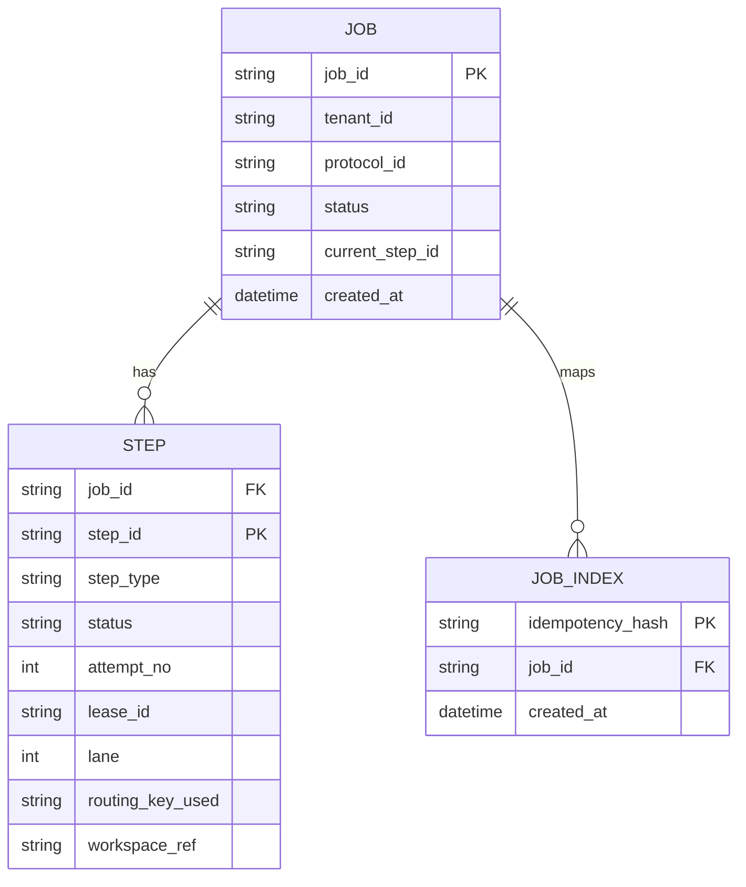
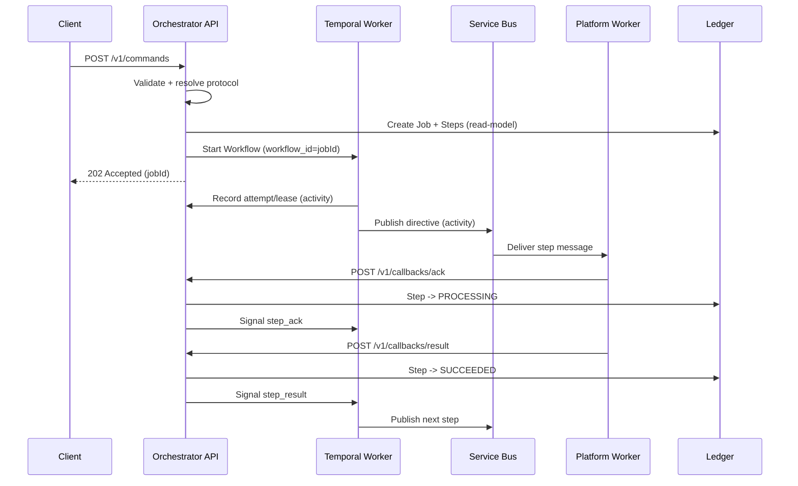
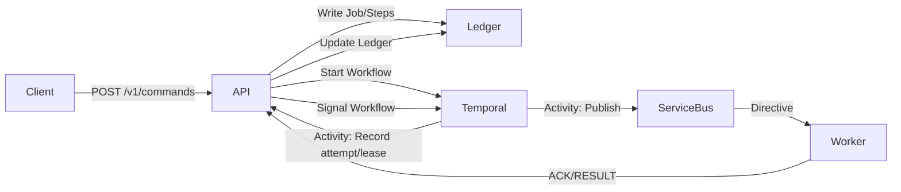

# LUCIUS Command Intelligence Orchestrator
# Temporal + Service Bus Implementation Spec (Extended)

This document consolidates the phase-2 blueprint and the Temporal design into a single, end-to-end implementation reference. It preserves existing functionality, replaces only the orchestration concerns that Temporal takes over, and keeps the Service Bus partition model intact.

---

## 1) Scope and Assumptions

**In scope**
- API + Orchestrator Gateway (FastAPI)
- Temporal workflows + activities
- Service Bus dispatch and routing lanes
- Ledger read-model (Azure Table Storage)
- Protocol registry + step schema validation
- AuthN/AuthZ at the API boundary

**Out of scope**
- Internal platform service logic (OCR/Embedding/SIS implementation)
- Artifact storage details beyond references
- Unified Services scale or SLOs

**Assumptions**
- Platform workers do **not** use Temporal SDK.
- Orchestrator is the only service that signals Temporal based on ACK/RESULT callbacks.
- Ledger is a read-model; Temporal is the orchestration source of truth.
- Protocol definitions and routing defaults are provided via configuration (e.g., Azure App Configuration).

---

## 2) Core Goals

- Preserve the existing API surface and contracts.
- Keep Service Bus topics and deterministic partitioning (lanes).
- Make orchestration durable: retries, timeouts, and sequencing handled by Temporal.
- Keep a clean, queryable ledger for job and step status.
- Maintain idempotency across duplicates and retries.

## 2.1 Non-Functional Requirements
- Scalability: Temporal workers scale horizontally; API scales for ingress.
- Backpressure: per-tenant inflight limits at ingress.
- Observability: structured logs, metrics, traces with correlation IDs.

---

## 3) Terminology

- **Job**: The end-to-end request instance.
- **Step**: One unit of work (OCR/Embedding/SIS), executed sequentially unless configured otherwise.
- **Workflow**: Temporal orchestrator for a job.
- **Activity**: A Temporal unit that performs an external side-effect (publish to Service Bus).
- **Lane**: Service Bus partition chosen by deterministic hash.
- **Ledger**: Azure Table Storage read-model for API queries.

---

## 4) API Surface (Unchanged)

- `POST /v1/commands`
- `GET /v1/jobs/{jobId}`
- `GET /v1/jobs/{jobId}/steps`
- `POST /v1/jobs/{jobId}:cancel`
- `POST /v1/callbacks/ack`
- `POST /v1/callbacks/result`

The command endpoint returns `202` as soon as the job and workflow are created.

### 4.1 Read APIs (Job/Step State)
- `GET /v1/jobs/{jobId}` returns job state from the ledger **Job** table and includes a collated list of steps from the **Step** table.
- `GET /v1/jobs/{jobId}/steps` returns a specific step’s state from the ledger **Step** table (one entry per step/attempt).
- These read APIs do not query Temporal directly; Temporal remains the source of truth for orchestration.

---

## 5) Request Envelope and Validation

### 5.1 Envelope (v1)
Required:
- `tenant_id`
- `request_type`
- `input_ref`
- `output_ref`
- `payload`
- `schema_version`

Optional:
- `mode` (DEFAULT or BURST)
- `idempotency_key`
- `doc_id` (required for BURST)
- `callback_urls`
- `correlation_id`, `traceparent`

### 5.2 Validation
- Envelope schema validation (required fields, types, schema_version).
- Protocol resolution from `request_type`.
- Step payload validation using protocol step schemas.
- Input/output reference validation and policy checks.

If validation fails, no job is created and a structured error is returned.

**Implementation note:** The orchestrator wires `SchemaValidator` + `ProtocolRegistry` in `POST /v1/commands` to validate the envelope and per-step payloads before job creation.

---

## 6) Protocol Registry and Step Definitions

- `request_type` maps to a protocol definition.
- Protocol defines ordered steps and ownership (platform service for each step).
- Steps are executed sequentially unless a workflow explicitly runs in parallel.

---

## 7) Routing and Partitioning (Service Bus)

### 7.1 Routing Key
- DEFAULT: `routing_key_used = tenant_id`
- BURST: `routing_key_used = tenant_id + doc_id` (doc_id required)

### 7.2 Lane Selection
- `lane = CRC32(utf8(routing_key_used)) % 16`

### 7.3 Topic
- `global-bus-p{lane}`

Lane and routing_key_used are stored in the ledger for audit and debugging.

---

## 8) Ledger Read-Model (Azure Table Storage)

The ledger is used by APIs for job/step state and is not the orchestration source of truth.
The **Job** and **Step** tables are updated on every ACK/RESULT callback, and attempt/lease is recorded before each publish.
Ledger entities use ETags for optimistic concurrency; updates should pass the last known ETag to avoid clobbering concurrent writes.

**Implementation note:** Idempotency is enforced via an idempotency hash + JobIndex; duplicate `POST /v1/commands` returns the existing `jobId`.

### 8.1 Data Model (ER Diagram)


### 8.2 Suggested Entities
- **Job**: job metadata and current step
- **Step**: step status and references
- **JobIndex**: idempotency lookups

### 8.3 Keying (single-table ledger option)
- `PartitionKey = job_id`
- `RowKey = JOB` or `STEP#{step_id}` or `IDX#{idempotency_hash}`

### 8.4 State Fields
Job:
- `status`, `current_step_id`, `created_at`, `tenant_id`, `protocol_id`

Step:
- `status`, `attempt_no`, `lease_id`, `lane`, `routing_key_used`, `workspace_ref`

---

## 9) Message Contracts

### 9.1 Directive (Orchestrator -> Platform)
Fields:
- `jobId`, `tenant_id`, `stepId`, `protocol_id`, `step_type`
- `attempt_no`, `lease_id`
- `input_ref`, `workspace_ref`, `output_ref`
- `payload`
- `callback_urls`
- `correlation_id`, `traceparent`

### 9.2 ACK Callback
- `POST /v1/callbacks/ack`
- Required: `jobId`, `stepId`, `tenant_id`, `attempt_no`, `lease_id`
- Ledger **Step** table: status -> `PROCESSING`
- Orchestrator signals Temporal: `step_ack`

### 9.3 RESULT Callback
- `POST /v1/callbacks/result`
- Required: `jobId`, `stepId`, `tenant_id`, `attempt_no`, `lease_id`, `status`
- Ledger **Step** table: status -> `SUCCEEDED` or `FAILED_FINAL`
- Orchestrator signals Temporal: `step_result`

Late or stale callbacks are recorded but do not mutate terminal states.

---

## 10) Temporal Design

### 10.0 Deployment Model
- Same codebase/image, different runtime roles (production standard for Temporal: separate API and worker processes for isolation and independent scaling).
- `lucius-orchestrator`: API Deployment + Service + HPA (if needed).
- `lucius-temporal-worker`: Worker Deployment + HPA (if needed).
- Both connect to the Temporal server; only the worker polls the task queue and runs workflows/activities.

### 10.0.1 Kubernetes Notes
- Use two Deployments (API + Worker) with the same image but different commands.
- API gets a Service; Worker does not need one unless you expose metrics.
- Scale independently (API by request load; Worker by workflow/activity throughput).

Example (minimal, schematic):
```yaml
apiVersion: apps/v1
kind: Deployment
metadata:
  name: lucius-orchestrator
spec:
  replicas: 2
  selector:
    matchLabels:
      app: lucius-orchestrator
  template:
    metadata:
      labels:
        app: lucius-orchestrator
    spec:
      containers:
        - name: api
          image: lucius/lucius-orchestrator:local
          command: ["uvicorn", "api.app:create_app", "--factory", "--host", "0.0.0.0", "--port", "8000"]
          env:
            - name: LUCIUS_TEMPORAL_ADDRESS
              value: temporal:7233
---
apiVersion: v1
kind: Service
metadata:
  name: lucius-orchestrator
spec:
  selector:
    app: lucius-orchestrator
  ports:
    - name: http
      port: 8000
      targetPort: 8000
---
apiVersion: apps/v1
kind: Deployment
metadata:
  name: lucius-temporal-worker
spec:
  replicas: 2
  selector:
    matchLabels:
      app: lucius-temporal-worker
  template:
    metadata:
      labels:
        app: lucius-temporal-worker
    spec:
      containers:
        - name: worker
          image: lucius/lucius-orchestrator:local
          command: ["python", "-m", "temporal_worker.main"]
          env:
            - name: LUCIUS_TEMPORAL_ADDRESS
              value: temporal:7233
            - name: LUCIUS_ORCHESTRATOR_URL
              value: http://lucius-orchestrator:8000
```

### 10.1 Workflow Inputs
- `jobId`, `tenant_id`, `protocol_id`
- `steps[]` (id, type, service, payload, refs)
- `lane`, `routing_key_used`, `mode`

### 10.2 Workflow Behavior
For each step:
1) Generate new `attempt_no` and `lease_id` for this publish attempt.
2) Persist attempt/lease to ledger **Step** table via `record_attempt_lease` activity.
3) Activity: publish directive to Service Bus.
4) Wait for `step_result` signal with timeout.
5) On `SUCCEEDED`, proceed to next step.
6) On `FAILED_FINAL`, fail workflow and mark job failed.
7) On timeout, re-publish (new attempt/lease) or fail based on policy.

Note: Steps 2 and 3 are executed sequentially by the workflow (no parallelism unless explicitly coded), then the workflow waits asynchronously on the `step_result` signal.
Note: API read endpoints return ledger **Job**/**Step** table state; Temporal workflow history remains the source of truth.

### 10.3 Activities
- `publish_to_bus(step, lane, routing_key_used)`
- `record_attempt_lease(jobId, stepId, attempt, lease)`

### 10.4 Signals
- `step_ack(jobId, stepId, attempt_no, lease_id)`
- `step_result(jobId, stepId, status, attempt_no, lease_id, error)`

Workers do not use Temporal SDK. Orchestrator receives callbacks and signals the workflow.

---

## 11) Retry and Timeout Policy

### 11.1 Publish Failure (Service Bus)
- Handled by Temporal activity retry policy.
- Each retry uses a **new** attempt_no and lease_id.

### 11.2 Execution Timeout
- Workflow waits for result signal with a configured SLA.
- On timeout, workflow either re-publishes or marks failed based on policy.

### 11.3 Max Attempts
- Default: 3 attempts per step.
- Exceeding attempts -> step/job `FAILED_FINAL`.

**Implementation note:** Tenant inflight gating is enforced at request time to cap concurrent jobs per tenant.

---

## 12) Cancellation Semantics

- `POST /v1/jobs/{jobId}:cancel` marks job `CANCELLING`.
- Workflow should stop starting new steps.
- If current step completes, job becomes `CANCELLED`.
- Late callbacks do not change terminal state.

---

## 13) End-to-End Sequence



---

## 14) Component Architecture



---

## 15) State Transitions

### 15.1 Job
- `QUEUED` -> `IN_PROGRESS` -> `SUCCEEDED`
- `QUEUED` -> `IN_PROGRESS` -> `FAILED_FINAL`
- `CANCELLING` -> `CANCELLED`

### 15.2 Step
- `PENDING` -> `INITIATED` -> `PROCESSING` -> `SUCCEEDED`
- `PENDING` -> `INITIATED` -> `FAILED_FINAL`

---

## 16) Failure Scenarios and Handling

### 16.1 Publish Failure
- Activity retry kicks in.
- Attempt/lease increments each retry.
- Ledger updated before each publish.

### 16.2 Callback with Stale Attempt/Lease
- Orchestrator ignores for state mutation.
- Still recorded for audit.

### 16.3 Worker Does Not Respond
- Workflow timeout fires.
- Re-publish or fail based on policy.

### 16.4 Duplicate Directives
- Workers must dedupe by `(jobId, stepId, attempt_no, lease_id)`.

---

## 17) Observability

- Correlation IDs included in directives and callbacks.
- Temporal workflow history provides durable trace.
- Ledger provides API-visible status snapshots.
- Metrics and traces should include step latency, retry counts, and timeout rates.

---

## 18) Implementation Checklist

- Add Temporal SDK + worker service.
- Start workflow from `POST /v1/commands`.
- Implement workflow with publish activity + signal handling.
- Wire ACK/RESULT callbacks to signal workflow.
- Keep ledger updates in orchestrator.
- Configure retry and timeout policies per step.

---

## 19) Open Decisions

- SLA timeouts per step type.
- Whether to store attempt/lease in ledger or only in Temporal history.
- Whether to mirror workflow state into ledger for reporting.
- Failure policy per step type (retryable vs non-retryable).

## 19.1 TODOs (Gaps vs current implementation)
- TODO: Callback authentication/authorization (mTLS or signed tokens) for `/v1/callbacks/*`.
- TODO: Explicit policy for stale ACK/RESULT handling (currently ignored and logged; spec should define whether to persist audit entries).

---

## 20) Persistence and Read-Model Notes

### 20.1 Ledger
- Job and step states are stored for API reads.
- Ledger is a read-model; Temporal is the orchestration source of truth.

### 20.2 Temporal Persistence
- Temporal server uses PostgreSQL/MySQL for workflow history.

---

## 21) Infra Changes

- Deploy Temporal server + persistence DB.
- Deploy Temporal workers (workflow + activities).
- Keep Service Bus topics and routing logic unchanged.

---

## 22) Migration Plan (Incremental)

1) Add Temporal server + worker service.
2) Modify `POST /v1/commands` to start workflow.
3) Modify callbacks to signal Temporal.
4) Disable outbox retry logic.
5) Monitor and tune timeouts/retry policies.
